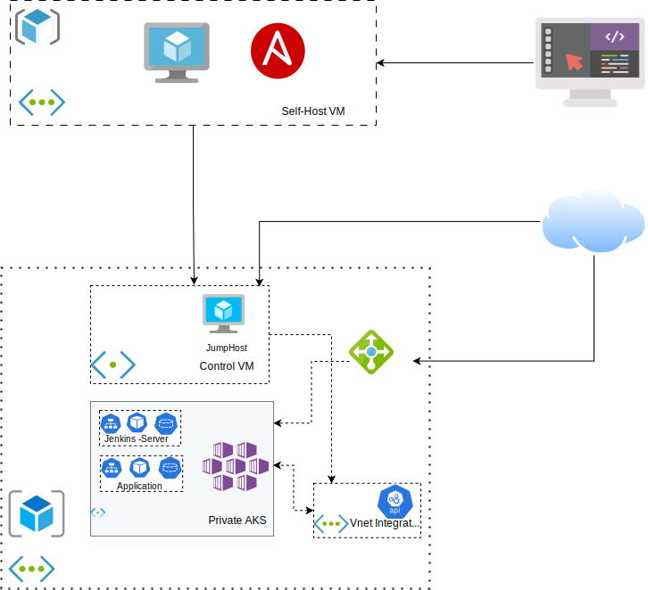

# Technical Overviews
This project is building the dynamic modern application on the Azure Provisioner. The proposed feature of this one is combined:
- Infrastructure as code: Manage infrastructure on the cloud provisioner by Terraform which the state is also stored on the Storage Account.
- Kubernetes Service on Azure: Running the core application and carry on the application flow
- Jenkins Server: Build the CI/CD process to deploy the application
- Helm Chart: Manage and deploy the kubenetes manifests
- Ansible: Control the configuration task on the Cloud resources.
# Summary project
This project simulates the typical Kubernetes to create the automatic CI/CD for deploying the applications on the AKS. For this reason, the proposed framework will include:
- Private AKS: Limit the communications with the API server from the specific VM's address
- Jenkins Servers: Deploy the Jenkins Server on AKS by Helm with the Statefull sets
- Core Application : The core application is followed the clean-architecture to interact to the timescale database



The workflow is kept to this one:

Build the Infrastructure with IaC tools --> Setup the kubernetes administrators --> Deploy the Jenkins Server --> Define the CI/CD pipeline --> Deploy the Applications
# Setup details
## Build the Infrastructure
Terraform is the main IaC tools to build the resources on the Azure from the folder: ``` ./infra/tf```. 

**Prerequisites** :
- The Self-Host machine installed and configure the Terraform
- Azure account/credentials
- Resources Group which is containerd the Storage Account to store the ```.tfstates``` file.

You can modify the values from the ``` .tfvars ``` file in case you want to custom the resources informations. However, this variables file is not icluded the credential for the AKS such as: Supscriptions, Tenant ID, Azure account ... Since this project will be used the Subscriptions to setup the credential for AKS, you have to define these with the Enviroment variables: 
```
TENANT_ID : Tennant ID
SP_ID : Service Principal Object ID 
SP_SECRET: Service Principal client secret
```

The commands is store to the script on the ``` ./infra/tf/cmd``` to run more quickly and reducing the mistake commands. The order will be included:

- tf-config: Setup the Storage resources to store the ```.tfstates``` file
- tf-run: Plan and run with the tfvars and neccessary variables
- tf-destroy: To clean up the projects

In case you prefer to the imperative approaches, you can followed this commands list:
- 

From this step you will have:
- Azure resources for Private AKS
- ```.tfstates``` to store the resources informations
- Ansible's Inventory  to manage the configurations

## Config the Kubernetes Administrator
The Private AKS is required the limitation VM to communicate with the Control Node throught out the API Server. For this reason, we need to configure the JumpHost VM as the Administrators node to configure and manage the Kubernetes resources. This setups will be followed:
- Install the kubectl, AZ CLI
- Login with the Azure Credentials
- Get the Kubernetes 
privileges

The setup task have been implement from Terraform with the Azure VM Extension resources. However, the configurement jobs will be executed with the Ansible playbooks. The inventory for this tools is also provided from the Terraform steps and saved on folder: ``` ./infra/ansible/inventory```. This inventory directory is included the dynamic inventory which is cached the resources informations and the local one.

### Configure with Ansible
This project is proposed the Dynamic and the local suggestion to interact with the resources informations such as: resources name, ip address, variables...

Run the playbooks to setup and prepare the compulsory manifest files:
``` 
ansible-playbook ./infra/ansible/setup-aks_plays.yml -i jenkin-aks/infra/ansible/config/inventory_tf.yml
```
This playbooks will execute with this order:
- Login with the Azure Credentials
- Get the Kubernetes Admin
- Copy the Manifest definations to the JumpHost VM

The output for this steps will combine:
- JumpHost VM with the Kubernetes admin permission from the ```.kubeconfig```
- JumpHostVM with the necessary manifest files
### Recreate the inventory file (Optional)
Configuration team can be reused their playbook with the infrastructure output variables. The inventory variable yaml file will be outputed on the ``` infra/tf/module/self_host/variable_file.yml```. From this template, we can ultilize the playbook from ``` infra/ansible/dynamic-host_play.yaml``` with this command: ``` ansible-playbook dynamic-host_plays.yml --extra-var  {your-template-variable-file}" ```.

## Deploy the AKS
AKS will be ultilized for host and orchestrate the applications. Define and deploy the application resources you can run with Helm or traditional way with the manifest yaml files. Not only run the core app, but you can also automatically the deployment tasks with the Jenkins servers.
### Jenkins Servers
The Jenkins server will be integrated to the AKS with the Helm Chart as the Statefulsets type. You can refer to the [Jenkins Kubernetes Guidelines](https://www.jenkins.io/doc/book/installing/kubernetes/) to see more details for this jobs.

To deploy the Jenkins chart to the Kubernetes, you have to
- Install the Helm
- Search and add the Jenkisn Chart repository
- Deploy manually the Storage Class for PVC
- Prepare the Valuables file

Because of deploying the Jenkins in AKS you need to assign the public/domain to access this server, you need to use the Load Balancer for the service AKS. The order deployments is going to follow:

SSH to JumpHost -> Helm add Jenkins chart -> Create the storage class -> Deploy Jenkins Chart from values file by Helm

From this values file, we will follow the helm command to deploy it imperative ways: 
```
helm repo add jenkinsci https://charts.jenkins.io
helm repo update
kubectl create -f sc_k8s.yaml
helm install jenkins -f values-jenkins_helm.yaml jenkinsci/jenkins
```

However, this project is proposed the declarative approaches by Ansible. From the machine run terraform, it will be created the inventory file for the JumphostVM. 

By this way, you can run 2 ansible playbooks: ``` ./infra/ansible/setup-aks_plays.yaml``` to copy the requirements manifest files and ``` ./infra/ansible/deploy-aks_plays.yml ``` to run the commands.
## Jenkins Servers
Install the Plugins

Prepare Agent/Slaves

Config the projects